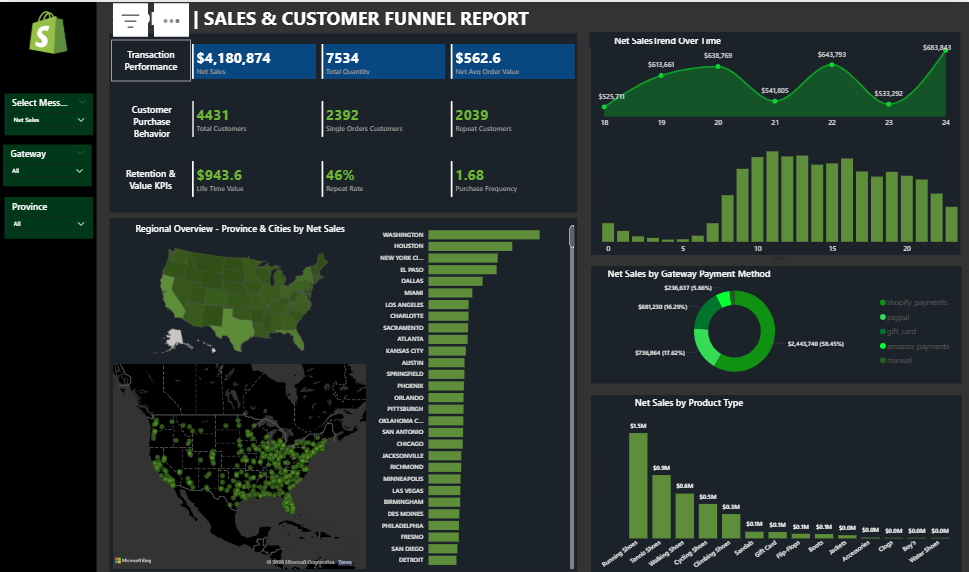
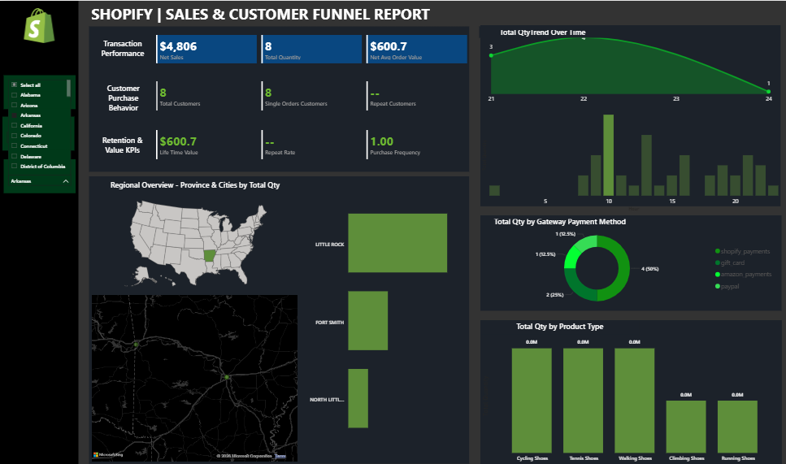
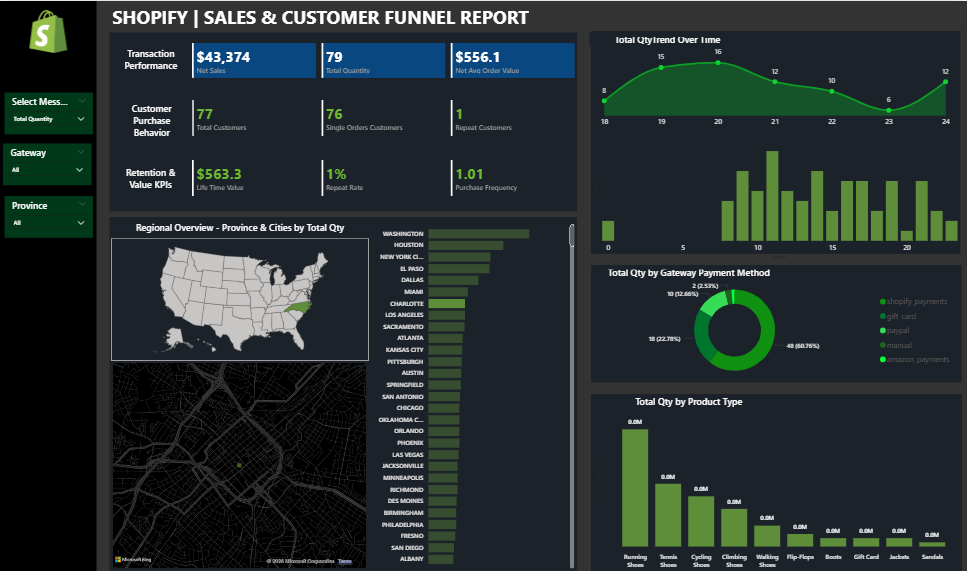

# Shopify Sales & Customer Funnel Dashboard (Power BI)

## 📊 Overview
This project analyzes Shopify e-commerce data to provide insights into sales performance, customer behavior, and product trends using Power BI.

## 🚀 Features
- KPI tracking (Net Sales, Total Quantity, Avg Order Value)
- Customer funnel analysis (Total, Single Order, Repeat Customers)
- Retention metrics (Repeat Rate, Purchase Frequency, Lifetime Value)
- Regional sales analysis (Province & City level)
- Payment method and product category insights
- Time-based sales trends

## 🛠 Tools & Technologies
- Power BI
- DAX
- Excel

## 📌 Key Insights
- Repeat customers contributed significantly to revenue growth
- Certain payment methods dominated transaction volume
- Sales trends showed peak activity during specific periods
- Product categories like shoes and accessories drove major sales

## 📸 Dashboard Preview

## 📁 Files
- shopify-dashboard.pbix
- data/shopify-sales-data.xlsx
